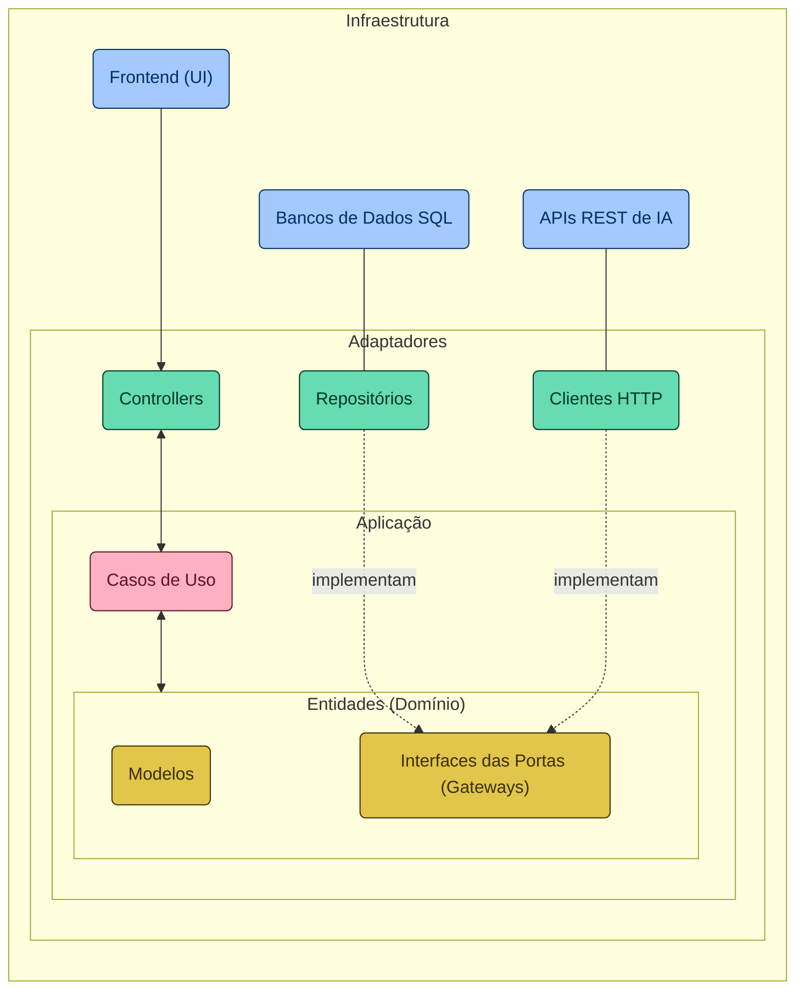

### 🗂️ Sobre o Projeto

Neste repositório, você encontrará o código-fonte de uma REST API e seu respectivo Frontend (pasta /docs), desenvolvidos durante a Santander Dev Week 2024, fruto de uma colaboração entre a DIO e o Santander. 
Este projeto, construído com Java 21 e Spring Boot 3, é o resultado de quatro dias de lives.

Para isso, foi utilizado a Inteligência Artificial (IA) Generativa da OpenAI e sua API de [Chat Completions](https://platform.openai.com/docs/guides/text-generation/chat-completions-api), possibilitando que nossa API "entenda" a 
personalidade única de cada campeão para criar interações que capturam sua essência, tornando cada conversa uma experiência única.

[Fonte: DIO](https://github.com/digitalinnovationone/santander-dev-week-2024)

### 🎯 Objetivo 

Permitir que os usuários conversem com os campeões do League of Legends (LOL).

### 🏗️ Arquitetura do Projeto
A seguir, apresentamos o diagrama arquitetural do projeto (escrito com Mermaid), destacando a separação das responsabilidades entre as camadas. Desde a interface de usuário até os mecanismos de interação com sistemas externos, 
passando por adaptadores, casos de uso e as entidades centrais do domínio, cada elemento é estrategicamente posicionado para reforçar a modularidade, a escalabilidade e a manutenibilidade do sistema. Esta estrutura facilita a 
compreensão de como os componentes colaboram para a realização dos objetivos do software, alinhando-se aos princípios da Clean Architecture (inclusive nas cores dos elementos).

### 🪜 Estrutura de Diretórios
Refletindo a organização apresentada no diagrama arquitetural, a estrutura de diretórios do projeto sugere uma Clean Architecture simplificada, visando a uma clara separação das responsabilidades e promovendo a autonomia das camadas em um projeto Spring Boot. 
Esta abordagem estrutural não só facilita a manutenção e a evolução do código, mas também sustenta a integração e a colaboração eficaz entre as diferentes partes da aplicação.

### 🎲  Banco de Dados SQL em Memória
A utilização do banco de dados H2 neste projeto serve como uma fundação ágil e flexível para modelar nosso domínio de conhecimento — os campeões do LOL. Essa escolha permite uma rápida prototipação e um ambiente de desenvolvimento eficiente, 
essencial para armazenar e recuperar informações detalhadas sobre cada campeão. Dessa forma, garantimos que as IAs Generativas que integramos possam acessar um repositório rico e detalhado, permitindo-lhes capturar com precisão a essência e a 
personalidade única de cada campeão, enriquecendo assim a interatividade e a profundidade das interações realizadas.

